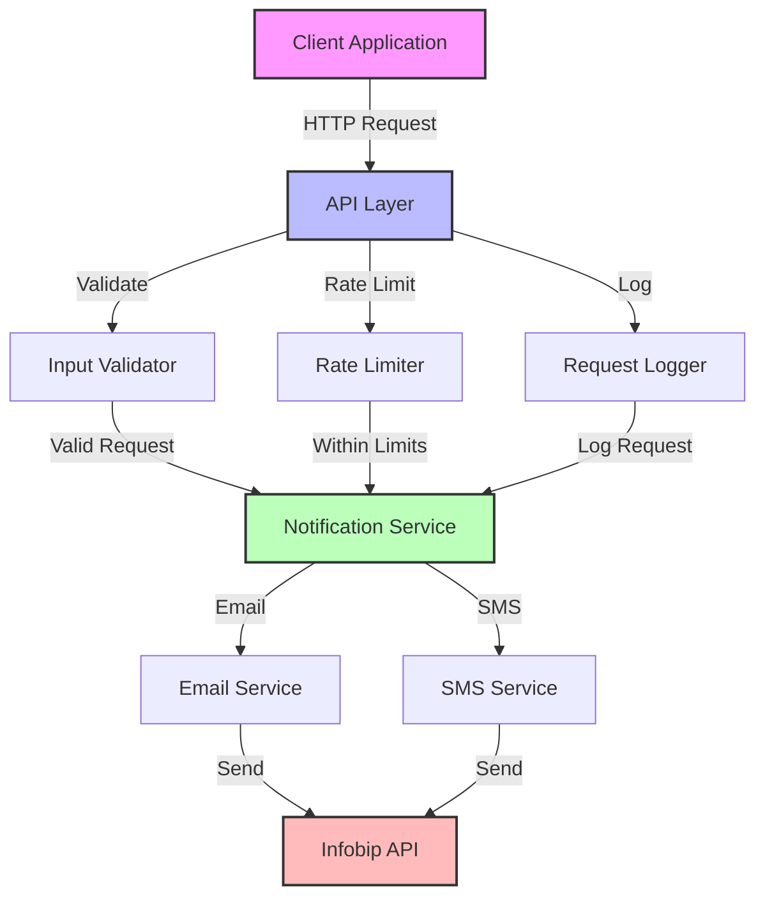
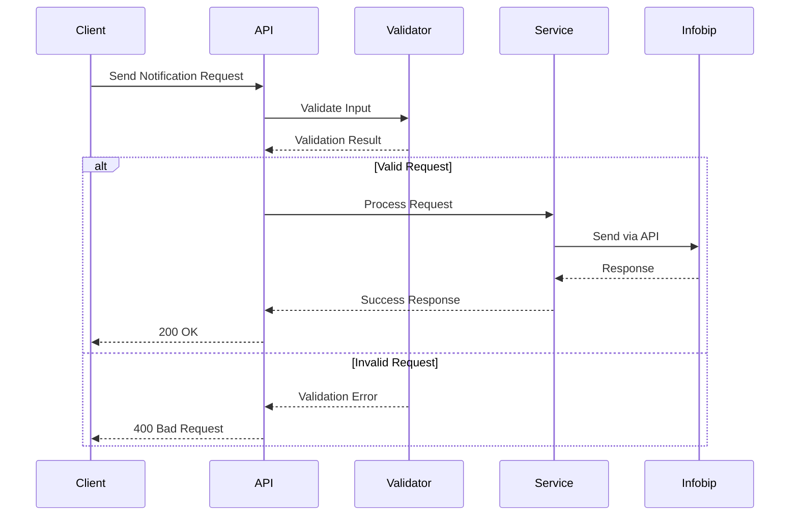
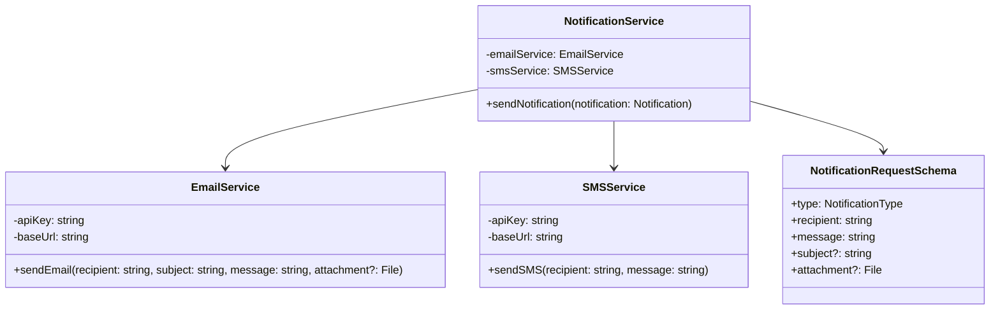
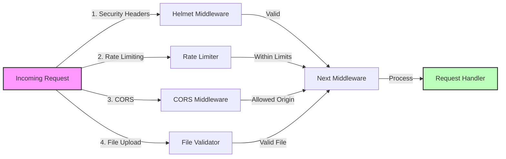
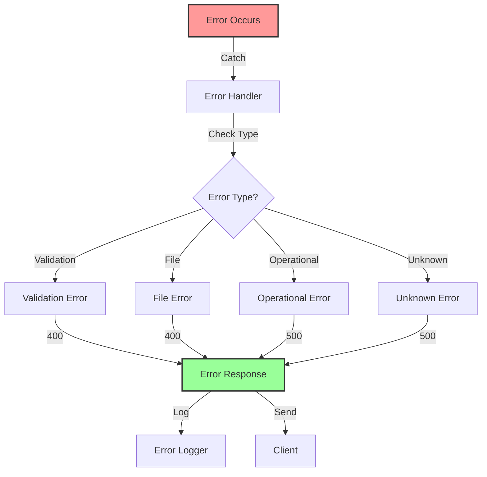
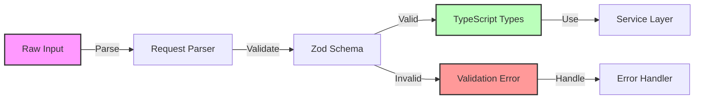

# System Architecture

This document provides visual representations of the Infobip Notification Service architecture using Mermaid.js diagrams.

## System Overview

## Request Flow

## Component Architecture

## Security Architecture

## Error Handling Flow

## Data Validation Flow

These diagrams provide a visual representation of:

1. Overall system architecture and component relationships
2. Request flow and processing
3. Component architecture and dependencies
4. Security implementation layers
5. Error handling flow
6. Data validation process

The diagrams are created using Mermaid.js and can be viewed directly on GitHub, which supports Mermaid.js rendering.
